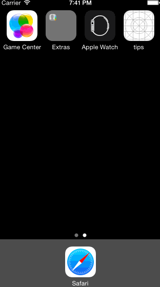

A basic tip calculator that will come in handy after your meal. Imagine that you and your friends, having just finished Sunday brunch with bottomless mimosas, are now facing the herculean task of calculating the proper amount of tip. Should you trust whatever the receipt suggested? Definitely not. Take control of your own finance by using this app.

Time Spent
Roughly 5 hours

Completed Features
Required: Tip calculation showing total amount
Required: Configurable default tip percentage
Optional: Animation when a user enters bill amount
Optional: Show total bill amount divided among 2 - 4 diners
Optional: Configurable default currency
Optional: Configurable background color

Installation Instructions
Since I don't have a development account with Apple at the moment, the only way to "install" it right now is to add this project to Xcode and use the iOS simulator.

GIF created with [LiceCap](http://www.cockos.com/licecap/).